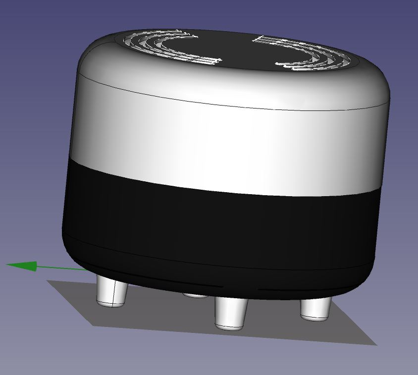

# CO2 Sensor

## Sensirion Carbon Dioxide Sensor (scd30)

* Web Site : <https://www.sensirion.com/en/environmental-sensors/carbon-dioxide-sensors/carbon-dioxide-sensors-scd30/>

* [Datasheet](Sensirion_CO2_Sensors_SCD30_Datasheet.pdf)

* [Specifications](Sensirion_CO2_Sensors_Chart_Overview.pdf)

* [Step files](https://www.sensirion.com/en/download-center/)

## Grabcad & Partcommunity

I grab the Sensision SCD30 CAD on <https://b2b.partcommunity.com>

Another great cad community parts : <https://grabcad.com>

## Design inspiration

* <https://www.luftlicht.de/fr/products/luftlicht>
* Nikodem Bartnik : <https://www.youtube.com/watch?v=aPeCT9wnzOQ>